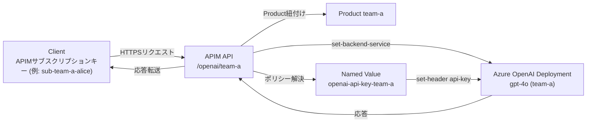

# 目的

Azure API Manager経由でAzure OpenAI APIを使用するAzureの設定を行う。

# 条件

1. 10名ほどのチームメンバーにAPIでAzure OpenAI APIを利用する環境を提供したい。
2. 元々Azure OpenAI APIを直接使用しているため、AIモデルはデプロイ済み。クライアントソフトウェアの互換性を保つため、APIM経由で利用する際も直接利用する場合と透過的に利用したい。
3. プロンプトキャッシュを活用するため２～３名ぐらいのユーザーごとに使用するOpenAIデプロイモデルを固定的に割り当てたい。

   | User | Key | APIM endpoint | AOAI endpoint |
   | --- | --- | --- | --- |
   | A | Key A | Same endpoint | endpoint 1 |
   | B | Key B | Same endpoint | endpoint 1 |
   | C | Key C | Same endpoint | endpoint 1 |
   | D | Key D | Same endpoint | endpoint 2 |
   | E | Key E | Same endpoint | endpoint 2 |
   | F | Key F | Same endpoint | endpoint 3 |
   | G | Key G | Same endpoint | endpoint 3 |

4. 特定のIPアドレスのみAPIMにアクセスできるようにip-filterを設定したい。
5. APIMのプランはconsumption planを使用する。そのため開発者ポータルやVNETを使えない。
6. Azure上にユーザーアカウントを作成せず、ユーザー毎にAPI Keyを発行する。

#### フロー図


## Azure CLIによる設定手順

### 0. 事前準備
- Azure CLI 2.60 以降を使用し、`az extension add --name apim` でAPIM拡張機能を導入しておく。
- `az login` と `az account set --subscription <subscription-id>` で操作対象サブスクリプションを明示する。
- 既存の Azure OpenAI リソースで使用するデプロイ名とエンドポイントURL、APIキーを控えておく。

### 1. パラメータの宣言
```bash
export RG_NAME="rg-aoai-apim"
export LOCATION="japaneast"
export APIM_NAME="apim-aoai-team"
export PUBLISHER_NAME="ExampleCorp"
export PUBLISHER_EMAIL="aoai-admin@example.com"
export OPENAI_ENDPOINT="https://<your-openai>.openai.azure.com/"
# 直接のAzure OpenAI呼び出し検証などでプレーンキーを使う場合のみ環境変数に保持する
# export OPENAI_API_KEY="<your-openai-api-key>"
# Key Vault を使う場合はボルト名などを控える
# export KV_NAME="<kv-name>"
# モデルごとの割り当て（グループ:デプロイ名）
MODEL_GROUPS=("team-a:gpt-4o" "team-b:gpt-4o-mini")
# グループごとに利用するAPIキーの取得元を定義（Key Vault優先）
declare -A MODEL_KEYVAULT_SECRET_IDS=(
  # ["team-a"]="/subscriptions/<sub>/resourceGroups/<kv-rg>/providers/Microsoft.KeyVault/vaults/<kv-name>/secrets/openai-api-key-team-a/<version>"
)
declare -A MODEL_API_KEYS=(
  # ["team-b"]="$(cat ./secrets/team-b-openai-key.txt)"
)
```
必要に応じて、モデルごとに利用者を分けるための識別子も変数化しておく。各グループについて `MODEL_KEYVAULT_SECRET_IDS` もしくは `MODEL_API_KEYS` のいずれかに値が入っていることを確認する（両方未設定だとエラーになるようにしておく）。

### 2. リソースグループとAPIMインスタンスの作成
```bash
az group create \
  --name "$RG_NAME" \
  --location "$LOCATION"

az apim create \
  --name "$APIM_NAME" \
  --resource-group "$RG_NAME" \
  --location "$LOCATION" \
  --publisher-name "$PUBLISHER_NAME" \
  --publisher-email "$PUBLISHER_EMAIL" \
  --sku-name Consumption \
  --enable-managed-identity
```
Key Vaultからシークレットを取得する場合はシステム割り当てマネージドIDを有効化したうえで、後続手順でアクセス権を付与する。

### 3. Named Value の登録
APIMでAzure OpenAIのエンドポイントとAPIキーを安全に参照できるよう、Named Valueを作成する。エンドポイントは共通設定を1件作成し、APIキーはグループ単位で別々のNamed Valueに分ける。
```bash
az apim nv create \
  --resource-group "$RG_NAME" \
  --service-name "$APIM_NAME" \
  --display-name "openai-endpoint" \
  --value "$OPENAI_ENDPOINT" \
  --secret false

for ENTRY in "${MODEL_GROUPS[@]}"; do
  GROUP_NAME="${ENTRY%%:*}"
  KEY_NV_NAME="openai-api-key-${GROUP_NAME}"
  if [ -n "${MODEL_KEYVAULT_SECRET_IDS[$GROUP_NAME]:-}" ]; then
    az apim nv create \
      --resource-group "$RG_NAME" \
      --service-name "$APIM_NAME" \
      --display-name "$KEY_NV_NAME" \
      --key-vault-secret-identifier "${MODEL_KEYVAULT_SECRET_IDS[$GROUP_NAME]}" \
      --secret true
  elif [ -n "${MODEL_API_KEYS[$GROUP_NAME]:-}" ]; then
    az apim nv create \
      --resource-group "$RG_NAME" \
      --service-name "$APIM_NAME" \
      --display-name "$KEY_NV_NAME" \
      --value "${MODEL_API_KEYS[$GROUP_NAME]}" \
      --secret true
  else
    echo "API key source for group ${GROUP_NAME} is not defined." >&2
    exit 1
  fi
done
```
Key Vaultを利用する場合は以下を実施し、APIMのマネージドIDにアクセス権を付与したうえでシークレットを登録する。
```bash
APIM_PRINCIPAL_ID="$(az apim show --resource-group "$RG_NAME" --name "$APIM_NAME" --query identity.principalId -o tsv)"

az keyvault set-policy \
  --name "$KV_NAME" \
  --object-id "$APIM_PRINCIPAL_ID" \
  --secret-permissions get list

mkdir -p ./secrets
for ENTRY in "${MODEL_GROUPS[@]}"; do
  GROUP_NAME="${ENTRY%%:*}"
  SECRET_NAME="openai-api-key-${GROUP_NAME}"
  SECRET_FILE="./secrets/${SECRET_NAME}.txt"

  # SECRET_FILE に対象デプロイのAPIキーを安全な方法で配置しておく
  az keyvault secret set \
    --vault-name "$KV_NAME" \
    --name "$SECRET_NAME" \
    --file "$SECRET_FILE"
  shred -u "$SECRET_FILE"

  MODEL_KEYVAULT_SECRET_IDS[$GROUP_NAME]="$(az keyvault secret show --vault-name "$KV_NAME" --name "$SECRET_NAME" --query id -o tsv)"
done
```
CLI履歴やプロセスリストに値を残したくない場合は `--value` ではなく `--file` を利用し、一時ファイルは安全に削除する。`./secrets` ディレクトリは `.gitignore` に追加し、保管期間を最小化する。Key Vaultを使わないケースでは `MODEL_API_KEYS` に値を投入し、ループ内で `--value` を指定する。

### 4. モデルごとのAPI定義
2～3名ずつ共有するモデルごとにAPIを分割する。以下は変数化したモデル情報からAPIとProductを生成するサンプル。
```bash
for ENTRY in "${MODEL_GROUPS[@]}"; do
  GROUP_NAME="${ENTRY%%:*}"
  DEPLOYMENT_NAME="${ENTRY##*:}"
  API_ID="aoai-${GROUP_NAME}"
  PRODUCT_ID="product-${GROUP_NAME}"
  KEY_NV_NAME="openai-api-key-${GROUP_NAME}"

  az apim api create \
    --resource-group "$RG_NAME" \
    --service-name "$APIM_NAME" \
    --api-id "$API_ID" \
    --display-name "AOAI ${GROUP_NAME}" \
    --path "openai/$GROUP_NAME" \
    --protocols https \
    --service-url "${OPENAI_ENDPOINT}openai/deployments/${DEPLOYMENT_NAME}/" \
    --subscription-key-parameter-names header='api-key'

  az apim product create \
    --resource-group "$RG_NAME" \
    --service-name "$APIM_NAME" \
    --product-id "$PRODUCT_ID" \
    --display-name "AOAI ${GROUP_NAME}" \
    --approval-required false \
    --subscriptions-limit 1

  az apim product api add \
    --resource-group "$RG_NAME" \
    --service-name "$APIM_NAME" \
    --product-id "$PRODUCT_ID" \
    --api-id "$API_ID"
done
```
`--path` は既存クライアントが利用しているリクエストパスに合わせて調整し、必要なら `--protocols` や `--subscription-required` を変更する。
各APIに対応するAPIキーのNamed Valueは `openai-api-key-${GROUP_NAME}`（例: `openai-api-key-team-a`）となるので、後続のポリシーで参照する。
クライアント側では既存と同じ `api-key` ヘッダを使い続けられるよう、APIMで発行したサブスクリプションキー値だけ差し替えてもらう。

### 5. ポリシーの適用（リクエスト透過化 + IP制限）
環境変数で値を差し込みながら `cat` で `policy-${GROUP_NAME}.xml` を生成し、APIM APIへ適用する。IP制限は許可アドレス列挙後に `forbid` を指定する。
```bash
export GROUP_NAME="team-a"
export AOAI_DEPLOYMENT_NAME="gpt-4o"
export POLICY_PATH="policy-${GROUP_NAME}.xml"
export POLICY_ALLOW_XML="$(cat <<'EOS'
    <address>203.0.113.10</address>
    <address>198.51.100.0/24</address>
EOS
)"

cat <<EOF > "$POLICY_PATH"
<policies>
  <inbound>
    <base />
    <ip-filter action="allow">
$POLICY_ALLOW_XML
    </ip-filter>
    <ip-filter action="forbid" />
    <set-backend-service base-url="{{openai-endpoint}}openai/deployments/${AOAI_DEPLOYMENT_NAME}/" />
    <set-header name="api-key" exists-action="override">
      <value>{{openai-api-key-${GROUP_NAME}}}</value>
    </set-header>
  </inbound>
  <backend>
    <base />
  </backend>
  <outbound>
    <base />
  </outbound>
  <on-error>
    <base />
  </on-error>
</policies>
EOF
```
`POLICY_ALLOW_XML` にIPアドレス要素を追加し、`AOAI_DEPLOYMENT_NAME` と `GROUP_NAME` は対象グループに合わせて置換する（例: `team-b` の場合は `{{openai-api-key-team-b}}` が生成される）。CLIで適用する例:
```bash
az apim api policy create \
  --resource-group "$RG_NAME" \
  --service-name "$APIM_NAME" \
  --api-id "$API_ID" \
  --value @"policy-${GROUP_NAME}.xml"
```
透過利用が必要なヘッダ（例: `Authorization`）があれば `set-header` で転送し、不要なヘッダは `remove-header` で削除する。
`set-backend-service` に末尾スラッシュを付与しておくことで、クライアントから受け取った相対パスをそのままバックエンドに引き渡しても二重パスにならない。

### 6. 利用者管理とサブスクリプションキーの発行
- APIMユーザーリソースを作成せず、Productに対するスタンドアロンサブスクリプションを発行する。  
  ```bash
  az apim subscription create \
    --resource-group "$RG_NAME" \
    --service-name "$APIM_NAME" \
    --scope "/products/${PRODUCT_ID}" \
    --display-name "sub-${GROUP_NAME}-alice" \
    --state active
  ```
  `--scope` は Product 単位で指定する。必要に応じて `--allow-tracing` や `--primary-key` を明示できる。
- 発行されたキーは `az apim subscription show --sid <subscription-id>` または作成コマンドの戻り値から `primaryKey` `secondaryKey` を取得し、社内の安全な手段で配布する。誰のキーか分かるよう `--display-name` に利用者情報を含めて台帳を管理する。

### 7. 動作確認と監視
- `curl` などでAPIM経由のリクエストを実行し、既存のAzure OpenAIと同等のレスポンスを返すことを確認する。
  ```bash
  curl "https://${APIM_NAME}.azure-api.net/openai/team-a/chat/completions?api-version=2024-02-15-preview" \
    -H "api-key: <team-a-sub-key>" \
    -H "Content-Type: application/json" \
    -d @payload.json
  ```
- ストリーム応答が遅延なく届くことを確認する。`stream=true` を指定して `curl --no-buffer` などでチャンクが逐次届くかを観察する。
  ```bash
  curl --no-buffer \
    "https://${APIM_NAME}.azure-api.net/openai/team-a/chat/completions?api-version=2024-02-15-preview" \
    -H "api-key: <team-a-sub-key>" \
    -H "Content-Type: application/json" \
    -d @streaming-payload.json
  ```
  先に直接のAzure OpenAIエンドポイントで同じリクエストを実行しチャンクタイミングを比較すると、APIM経由でもリアルタイム性が保たれているかを確認しやすい。
  ```bash
  curl --no-buffer "https://<your-openai>.openai.azure.com/openai/deployments/<deployment>/chat/completions?api-version=2024-02-15-preview" \
    -H "api-key: <team-a-openai-api-key>" \
    -H "Content-Type: application/json" \
    -d @streaming-payload.json \
    | while IFS= read -r line; do printf '%s %s\n' "$(date +'%H:%M:%S.%3N')" "$line"; done

  curl --no-buffer "https://${APIM_NAME}.azure-api.net/openai/team-a/chat/completions?api-version=2024-02-15-preview" \
    -H "api-key: <team-a-sub-key>" \
    -H "Content-Type: application/json" \
    -d @streaming-payload.json \
    | while IFS= read -r line; do printf '%s %s\n' "$(date +'%H:%M:%S.%3N')" "$line"; done
  ```
  上記のようにタイムスタンプを付与してログを比較し、最初のチャンクが届くまでの時間や各チャンク間隔に大きな差がないことを確認する。
  Key Vaultでキーを管理している場合は `az keyvault secret show --vault-name "$KV_NAME" --name "openai-api-key-team-a" --query value -o tsv` 等で一時的に取り出し、検証後はシェル履歴や一時変数を破棄する。
- ログ出力は`az monitor diagnostic-settings create`でLog Analyticsへ転送し、モデルごと・ユーザーごとの利用状況をDashboardsやWorkbooksで可視化する。

### 8. 運用
- IPリストやAPIキーのローテーションはRunbook化し、変更時は `az apim nv update` や `az apim api policy update` を利用する。
- 新規モデルを追加する場合は、上記のループにエントリを追加してAPI・Productを増やし、該当ユーザーのサブスクリプションを付け替える。
