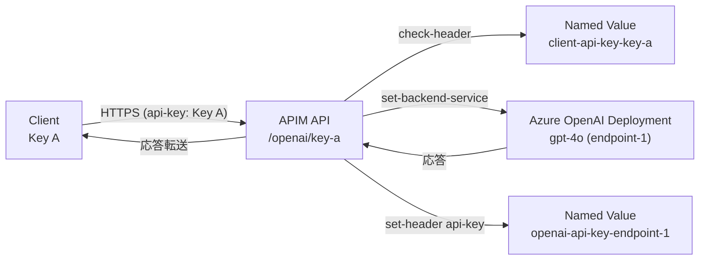

# 目的

Azure API Manager経由でAzure OpenAI APIを使用するAzureの設定を行う。

# 条件

1. 10名ほどのチームメンバーにAPIでAzure OpenAI APIを利用する環境を提供したい。
2. 元々Azure OpenAI APIを直接使用しているため、AIモデルはデプロイ済み。クライアントソフトウェアの互換性を保つため、APIM経由で利用する際も直接利用する場合と透過的に利用したい。
3. プロンプトキャッシュを活用するため２～３名ぐらいのユーザーごとに使用するOpenAIデプロイモデルを固定的に割り当てたい。

   | User | Key | APIM endpoint | AOAI endpoint |
   | --- | --- | --- | --- |
   | A | Key A | endpoint A | endpoint 1 |
   | B | Key B | endpoint B | endpoint 1 |
   | C | Key C | endpoint C | endpoint 1 |
   | D | Key D | endpoint D | endpoint 2 |
   | E | Key E | endpoint E | endpoint 2 |
   | F | Key F | endpoint F | endpoint 3 |
   | G | Key G | endpoint G | endpoint 3 |

4. 特定のIPアドレスのみAPIMにアクセスできるようにip-filterを設定したい。
5. APIMのプランはconsumption planを使用する。そのため開発者ポータルやVNETを使えない。
6. Azure上にユーザーアカウントを作成せず、ユーザー毎にAPI Keyを発行する。

#### フロー図


## Azure CLIによる設定手順

### 0. 事前準備
- VS Code を使う場合は Dev Containers 拡張機能をインストールし、Microsoft Learn の「Run Azure CLI in a Docker container」で紹介されている公式 Azure CLI コンテナーをベースに `.devcontainer` を構成する。セットアップ後は `Dev Containers: Rebuild and Reopen in Container` を実行すれば Azure CLI が利用できる。
- Azure CLI 2.60 以降を使用し、`az extension add --name apim` でAPIM拡張機能を導入しておく。
- `az login` と `az account set --subscription <subscription-id>` で操作対象サブスクリプションを明示する。
- 既存の Azure OpenAI リソースで使用するデプロイ名とエンドポイントURL、APIキーを控えておく。

### 1. パラメータの宣言
- リポジトリ直下の `scripts/step1-params.sh` に、リソース名やモデル別設定など本手順で利用する環境変数をまとめている。`RG_NAME` や `MODEL_GROUPS`、`MODEL_SERVICE_URLS`、`MODEL_ALLOWED_IPS` に加えて、クライアントごとの `CLIENT_ENDPOINTS` / `CLIENT_ENDPOINT_GROUPS` / `CLIENT_ENDPOINT_PATHS` を定義し、どのAzure OpenAIデプロイへルーティングするかを記述する。
- APIバージョンは `OPENAI_API_VERSION`（グループごとに変えたい場合は `MODEL_API_VERSIONS`）で管理する。最新のプレビュー版を使う場合などはここを更新し、後続スクリプトの引数に自動反映させる。
- Azure OpenAIのAPIキーは `MODEL_API_KEYS` に、クライアント用のAPIMキーは `CLIENT_ENDPOINT_KEYS` に定義する。サンプルでは `$(<"${HOME}/secrets/...")` 形式でローカルファイルから読み込むようにしているので、実際のパスに合わせて更新する。**平文をリポジトリに記述しないこと。**
- Azure CLI を使うシェルを開いたら、Step 2 に進む前に `source scripts/step1-params.sh` を実行して環境変数を読み込む（実行ではなく *source* する）。スクリプトにはプレースホルダーや未設定値が残っていると失敗するバリデーションを入れているため、エラーが出る場合は設定を見直す。
- 新しいシェルを開いた場合や値を変更した場合も同じように `source scripts/step1-params.sh` を実行してから先のステップを進める。

### 2. リソースグループとAPIMインスタンスの作成
- `scripts/step2-create-apim.sh` を実行すると、Step 1 で設定した値を取り込んだうえでリソースグループとAPIM（Consumption SKU、マネージドID有効化）を作成する。既にAPIMが存在する場合は作成をスキップして完了する。
- 事前に Step 1 スクリプトを `source` し、Azure CLIで対象サブスクリプションが選択されていることを確認する。
- 実行例: `bash scripts/step2-create-apim.sh`

### 3. Named Value の登録
- `scripts/step3-create-named-values.sh` を実行すると、Step 1 で宣言した `MODEL_GROUPS` を走査し、各グループの `openai-service-url-<group>`（非シークレット）と `openai-api-key-<group>`（シークレット）をAPIMのNamed Valueとして作成または更新する。
- 同じスクリプトで `CLIENT_ENDPOINTS` も走査し、クライアント認証に使う `client-api-key-<endpoint>` Named Value を作成する（ポリシーの `<check-header>` で照合するため、Step 5 の前に必須）。
- スクリプトは `scripts/step1-params.sh` を再度 `source` し、未設定やプレースホルダーが残っているとエラーで停止する。APIキーも同様に `MODEL_API_KEYS` / `CLIENT_ENDPOINT_KEYS` に読み込んでおく。
- 既存のNamed Valueが存在する場合は `az apim nv update` を用いて値を更新するため、再実行時も安全。
- 実行例: `bash scripts/step3-create-named-values.sh`

### 4. クライアントごとのAPI定義
- `scripts/step4-configure-apis.sh` を実行すると、`CLIENT_ENDPOINTS` に定義した各キー専用のAPIM APIを作成（既存の場合は更新）する。APIパスはデフォルトで `openai/<endpoint>`、API ID は `aoai-<endpoint>` になる。
- サンプルのままでよければ設定不要だが、個別に変えたい場合は `CLIENT_ENDPOINT_PATHS`（パス）、`CLIENT_ENDPOINT_API_IDS`（API ID）、`CLIENT_ENDPOINT_API_DISPLAY_NAMES`（表示名）を連想配列で上書きできる。
- すべてのAPIで `subscription-required=false` を設定し、APIM組み込みのサブスクリプションキーではなく後述の `<check-header>` ポリシーで認証する運用に切り替えている。
- 実行例: `bash scripts/step4-configure-apis.sh`

### 5. ポリシーの適用（リクエスト透過化 + IP制限）
- `scripts/step5-apply-policies.sh` はクライアントエンドポイントごとに `<ip-filter>`・`<check-header>`・`set-backend-service` を含むポリシーを生成する。APIは Step 4 で作成済みであることが前提。
- `MODEL_ALLOWED_IPS` はバックエンドグループ単位で管理し、同じグループに紐づくエンドポイントは共通のIP許可リストを共有する。
- クライアントの `api-key` ヘッダは `client-api-key-<endpoint>` Named Value と照合され、一致しない場合は 401 を返す。バックエンドに転送する際は `openai-api-key-<group>` を `set-header` で上書きする。
- 追加加工が必要な場合は `MODEL_POLICY_EXTRA_*` にXML断片を記述すると該当セクションへ挿入できる。
- 実行例: `bash scripts/step5-apply-policies.sh`

### 6. クライアントキーの同期（Named Value化）
- Step 3 で初期登録した `client-api-key-*` をローテーションしたいときは `scripts/step6-manage-subscriptions.sh` を実行する。最新の `CLIENT_ENDPOINT_KEYS` を再読み込みし、Named Value を再作成したうえで対応表を出力する。
- スクリプト実行後に、エンドポイント名・APIMパス・バックエンドの対応関係を表にまとめて出力する。利用者への共有には `~/secrets/...` の元ファイルや安全なシークレットマネージャーを使う。
- 実行例: `bash scripts/step6-manage-subscriptions.sh`

### 7. 動作確認と監視
- `scripts/step7-validate.sh` を利用して、同一ペイロードをクライアント用APIMエンドポイントと（必要に応じて）直接のAzure OpenAIに送り、レスポンスやHTTPステータス、エラー内容を比較できる。例:
  ```bash
  bash scripts/step7-validate.sh \
    --endpoint key-a \
    --file payloads/chat.json \
    --client-key "$(pass show apim/key-a)" \
    --stream
  ```
- `--stream` を付けると `curl --no-buffer` を使ってチャンクが逐次出力される。クライアントキーは `--client-key` または `CLIENT_ENDPOINT_KEYS[key]` で渡せる。直接のAzure OpenAI呼び出しをスキップしたい場合は `--skip-direct` を指定する。
- `--path` で `chat/completions` 以外のAPIを指定でき、`--api-version` でプレビューバージョンなどを切り替えられる。デフォルトでは `OPENAI_API_VERSION`（グループごとに指定している場合は `MODEL_API_VERSIONS`）を使用する。
- タイミング比較など詳細な観測が必要な場合は、上記スクリプトの出力を `ts '%H:%M:%S.%3N'` などにパイプしてタイムスタンプを追加するか、生成されたURLを使って個別に `curl` を実行して計測する。
- 運用監視は `az monitor diagnostic-settings create` を活用し、Log Analytics やダッシュボードでリクエスト数・レイテンシ・エラー率を追跡する。必要に応じてモデル／グループ単位のクエリを作成しておく。

### 8. 運用
- IPリストやAPIキーのローテーションはRunbook化し、変更時は `az apim nv update` や `az apim api policy update` を利用する。
- 新規モデル（バックエンドグループ）を追加する場合は `MODEL_GROUPS` と関連するNamed Valueを増やし、紐付けたいクライアントは `CLIENT_ENDPOINTS` に追記する。これにより自動で専用API・ポリシー・キーが展開される。
