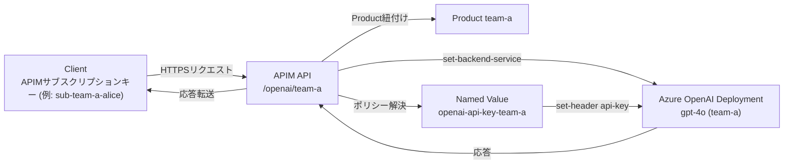

# 目的

Azure API Manager経由でAzure OpenAI APIを使用するAzureの設定を行う。

# 条件

1. 10名ほどのチームメンバーにAPIでAzure OpenAI APIを利用する環境を提供したい。
2. 元々Azure OpenAI APIを直接使用しているため、AIモデルはデプロイ済み。クライアントソフトウェアの互換性を保つため、APIM経由で利用する際も直接利用する場合と透過的に利用したい。
3. プロンプトキャッシュを活用するため２～３名ぐらいのユーザーごとに使用するOpenAIデプロイモデルを固定的に割り当てたい。

   | User | Key | APIM endpoint | AOAI endpoint |
   | --- | --- | --- | --- |
   | A | Key A | Same endpoint | endpoint 1 |
   | B | Key B | Same endpoint | endpoint 1 |
   | C | Key C | Same endpoint | endpoint 1 |
   | D | Key D | Same endpoint | endpoint 2 |
   | E | Key E | Same endpoint | endpoint 2 |
   | F | Key F | Same endpoint | endpoint 3 |
   | G | Key G | Same endpoint | endpoint 3 |

4. 特定のIPアドレスのみAPIMにアクセスできるようにip-filterを設定したい。
5. APIMのプランはconsumption planを使用する。そのため開発者ポータルやVNETを使えない。
6. Azure上にユーザーアカウントを作成せず、ユーザー毎にAPI Keyを発行する。

#### フロー図


## Azure CLIによる設定手順

### 0. 事前準備
- VS Code を使う場合は Dev Containers 拡張機能をインストールし、Microsoft Learn の「Run Azure CLI in a Docker container」で紹介されている公式 Azure CLI コンテナーをベースに `.devcontainer` を構成する。セットアップ後は `Dev Containers: Rebuild and Reopen in Container` を実行すれば Azure CLI が利用できる。
- Azure CLI 2.60 以降を使用し、`az extension add --name apim` でAPIM拡張機能を導入しておく。
- `az login` と `az account set --subscription <subscription-id>` で操作対象サブスクリプションを明示する。
- 既存の Azure OpenAI リソースで使用するデプロイ名とエンドポイントURL、APIキーを控えておく。

### 1. パラメータの宣言
- リポジトリ直下の `scripts/step1-params.sh` に、リソース名やモデル別設定など本手順で利用する環境変数をまとめている。`RG_NAME` や `MODEL_GROUPS`、`MODEL_SERVICE_URLS`、`MODEL_API_KEYS`、`MODEL_ALLOWED_IPS`、`MODEL_SUBSCRIPTIONS` などを自分の環境に合わせて編集し、プレースホルダー（`<your-openai-...>` や `<team-a-allow-ip-1>` など）が残らないよう更新する。
- APIバージョンは `OPENAI_API_VERSION`（グループごとに変えたい場合は `MODEL_API_VERSIONS`）で管理する。最新のプレビュー版を使う場合などはここを更新し、後続スクリプトの引数に自動反映させる。
- APIキーは `MODEL_API_KEYS` に安全な方法で読み込む。サンプルでは `$(<"${HOME}/secrets/..." )` で外部ファイルから取り込む例をコメントアウトで示しているので、運用に合わせて有効化する。
- Azure CLI を使うシェルを開いたら、Step 2 に進む前に `source scripts/step1-params.sh` を実行して環境変数を読み込む（実行ではなく *source* する）。スクリプトにはプレースホルダーや未設定値が残っていると失敗するバリデーションを入れているため、エラーが出る場合は設定を見直す。
- 新しいシェルを開いた場合や値を変更した場合も同じように `source scripts/step1-params.sh` を実行してから先のステップを進める。

### 2. リソースグループとAPIMインスタンスの作成
- `scripts/step2-create-apim.sh` を実行すると、Step 1 で設定した値を取り込んだうえでリソースグループとAPIM（Consumption SKU、マネージドID有効化）を作成する。既にAPIMが存在する場合は作成をスキップして完了する。
- 事前に Step 1 スクリプトを `source` し、Azure CLIで対象サブスクリプションが選択されていることを確認する。
- 実行例: `bash scripts/step2-create-apim.sh`

### 3. Named Value の登録
- `scripts/step3-create-named-values.sh` を実行すると、Step 1 で宣言した `MODEL_GROUPS` を走査し、各グループの `openai-service-url-<group>`（非シークレット）と `openai-api-key-<group>`（シークレット）をAPIMのNamed Valueとして作成または更新する。
- スクリプトは `scripts/step1-params.sh` を再度 `source` し、未設定やプレースホルダーが残っているとエラーで停止する。APIキーも同様に `MODEL_API_KEYS` に読み込んでおく。
- 既存のNamed Valueが存在する場合は `az apim nv update` を用いて値を更新するため、再実行時も安全。
- 実行例: `bash scripts/step3-create-named-values.sh`

### 4. モデルごとのAPI定義
- `scripts/step4-configure-apis.sh` を実行すると、各モデルグループ向けのAPIM APIとProductを作成（既存の場合は更新）し、両者を関連付ける。デフォルトでは API ID を `aoai-<group>`、Product ID を `product-<group>`、パスを `openai/<group>` に設定する。
- これらのIDや表示名、パスを変えたい場合は `scripts/step1-params.sh` で以下の連想配列を必要に応じて定義し、グループ名をキーに値を設定しておく。
  - `declare -Ag MODEL_API_IDS`（API ID）
  - `declare -Ag MODEL_PRODUCT_IDS`（Product ID）
  - `declare -Ag MODEL_API_PATHS`（APIパス）
  - `declare -Ag MODEL_API_DISPLAY_NAMES` / `MODEL_PRODUCT_DISPLAY_NAMES`（表示名）
- スクリプトは `scripts/step1-params.sh` を再度 `source` し、`MODEL_SERVICE_URLS` の未設定やプレースホルダーが残っている場合はエラーで停止する。Named Value（Step 3）で作成した `openai-service-url-*` / `openai-api-key-*` をそのまま参照できる想定で、クライアントからは従来どおり `api-key` ヘッダを利用できる。
- 実行例: `bash scripts/step4-configure-apis.sh`

### 5. ポリシーの適用（リクエスト透過化 + IP制限）
- `scripts/step5-apply-policies.sh` を実行すると、各グループのAPIに対して `<ip-filter>` による許可リスト、`set-backend-service`、`set-header api-key` を含むポリシーを生成し適用する。`MODEL_GROUPS` の内容を走査し、Named Value（Step 3）とAPI（Step 4）が揃っている前提で動作する。
- アクセスを許可するIPアドレス/CIDRは `scripts/step1-params.sh` の `MODEL_ALLOWED_IPS` にスペース区切りで設定する。サンプルのプレースホルダー（`<team-a-allow-ip-1>` など）は必ず実際の値に置き換える。
- 追加で透過させたいヘッダや加工がある場合は、同じく Step 1 で `MODEL_POLICY_EXTRA_INBOUND` / `MODEL_POLICY_EXTRA_BACKEND` / `MODEL_POLICY_EXTRA_OUTBOUND` / `MODEL_POLICY_EXTRA_ON_ERROR` にXML断片を指定すると、そのまま該当セクションへ差し込まれる。
- API ID やパスをカスタマイズしている場合でも、Step 4 と同じく `MODEL_API_IDS` などの連想配列を設定しておけば本スクリプトからも参照できる。
- 実行例: `bash scripts/step5-apply-policies.sh`

### 6. 利用者管理とサブスクリプションキーの発行
- `scripts/step6-manage-subscriptions.sh` を実行すると、Step 1 の `MODEL_SUBSCRIPTIONS` に列挙した表示名ごとにAPIMサブスクリプションを作成または更新し、`primaryKey` / `secondaryKey` を出力する。グループごとにProductへひも付けた状態で発行する。
- サブスクリプションIDを明示したい場合は `MODEL_SUBSCRIPTION_IDS` に `display-name -> id` を設定する（未指定時は表示名をそのままIDとして利用）。ステータスやキーを固定したい場合は `MODEL_SUBSCRIPTION_STATES`、`MODEL_SUBSCRIPTION_PRIMARY_KEYS`、`MODEL_SUBSCRIPTION_SECONDARY_KEYS` に値を登録しておく。
- Product ID をカスタマイズしている場合でも、Step 4 同様に `MODEL_PRODUCT_IDS` を設定していれば本スクリプトが参照する。該当グループにサブスクリプションを作りたくない場合は `MODEL_SUBSCRIPTIONS["group"]` を空にする。
- 実行例: `bash scripts/step6-manage-subscriptions.sh`。出力されたキーは安全な保管場所に移し、ユーザーへは安全な経路で配布する。

### 7. 動作確認と監視
- `scripts/step7-validate.sh` を利用して、同一ペイロードをAPIMと（必要に応じて）直接のAzure OpenAIに送り、レスポンスやHTTPステータス、エラー内容を比較できる。例:
  ```bash
  bash scripts/step7-validate.sh \
    --group team-a \
    --file payloads/chat.json \
    --subscription-key "$(pass show apim/team-a-primary)" \
    --stream
  ```
  `--stream` を付けると `curl --no-buffer` を使ってチャンクが逐次出力される。APIMキーは `--subscription-key` または `APIM_SUBSCRIPTION_KEY` で渡す（Step 1 の `MODEL_SUBSCRIPTION_PRIMARY_KEYS` に登録しておけば自動参照される）。直接のAzure OpenAI呼び出しをスキップしたい場合は `--skip-direct` を指定する。
- `--endpoint` で `chat/completions` 以外のエンドポイントを指定でき、`--api-version` でプレビューバージョンなどを切り替えられる。デフォルトでは `OPENAI_API_VERSION`（グループごとに指定している場合は `MODEL_API_VERSIONS`）を使用する。
- タイミング比較など詳細な観測が必要な場合は、上記スクリプトの出力を `ts '%H:%M:%S.%3N'` などにパイプしてタイムスタンプを追加するか、生成されたURLを使って個別に `curl` を実行して計測する。
- 運用監視は `az monitor diagnostic-settings create` を活用し、Log Analytics やダッシュボードでリクエスト数・レイテンシ・エラー率を追跡する。必要に応じてモデル／グループ単位のクエリを作成しておく。

### 8. 運用
- IPリストやAPIキーのローテーションはRunbook化し、変更時は `az apim nv update` や `az apim api policy update` を利用する。
- 新規モデルを追加する場合は、上記のループにエントリを追加してAPI・Productを増やし、該当ユーザーのサブスクリプションを付け替える。
